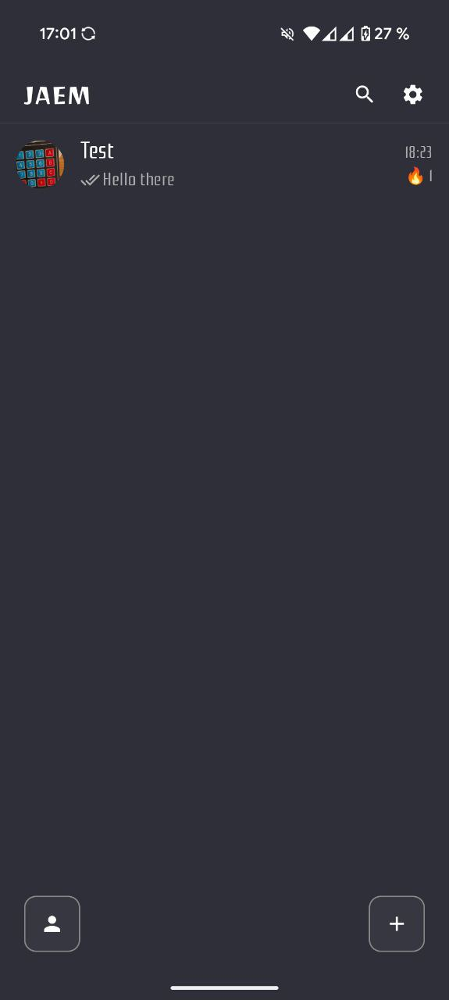
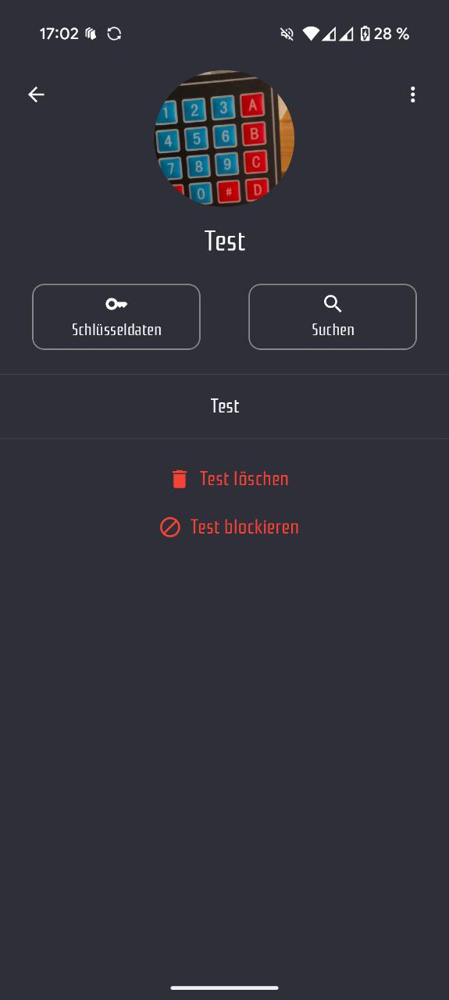

# 🔐 JAEM – Just Another Encrypted Messenger

<!-- App Icon -->

  

## 📝 Description
**JAEM** is an encrypted messaging app designed for secure, private, and distraction-free communication.  

With JAEM, you'll never receive annoying requests from bots or scammers pretending to be someone else. Instead, you can communicate **confidentially and securely** through strong end-to-end encryption.  

Messages are stored only until your recipient receives them, ensuring that **nobody except you and your conversation partner** can ever read your conversations.  

---

## ✨ Key Features
- **End-to-End Encryption** – Only you and your conversation partner can read your messages.  
- **No Spam, No Bots** – Clean, meaningful communication without unwanted requests.  
- **Temporary Storage** – Messages are deleted permanently once delivered.  
- **Dynamic Servers** – Select and switch backend servers anytime.  
- **Themes** – Multiple stylish themes (System Default, Light, Dark, Crypto).  
- **Languages** – Supports *English, German, Korean, Russian* (more coming soon).  

---

## 🚀 Development Status
- [x] Core end-to-end encryption implemented  
- [x] Multi-language support (English, German, Korean, Russian)  
- [ ] Fix parsing issues with Korean names  
- [ ] Restrict message deletion to sender only  
- [ ] Message editing support  
- [ ] Profile editing & deletion  
- [ ] Message attachments  
- [ ] Improved server sync (send messages only to joined servers)  
- [ ] More encryption algorithms  
- [ ] Bug fixes & error handling improvements  

---

## 🖼️ Screenshots
<!-- Replace with actual paths to your screenshots -->

  
  
  

---

## 🌐 Useful Links
- [🖥️ Backend Repository](https://github.com/antoniomikley/jaem-server)  

---

## 🛠️ Technology
- **Frontend / Client**: Android (Kotlin, Jetpack Compose)  
- **Backend**: Custom server (Rust/Go/…) *(adjust if needed)*  
- **Encryption**: End-to-end with planned algorithm extensions  

---

## 👥 Project Team
| Name               | Role                     | GitHub                                      |
|--------------------|--------------------------|---------------------------------------------|
| Lennard Stubbe     | Lead Developer           | [@LS-Studios](https://github.com/LS-Studios) |
| Nick Schefner      | User Discovery Service   | [@ItsJuzoSuzuya](https://github.com/ItsJuzoSuzuya) |
| Antonio Mikley     | Server Architecture      | [@antoniomikley](https://github.com/antoniomikley) |

---

## ⚖️ License
This project is licensed under the **GNU License**.  
See [LICENSE](LICENSE) for details.
